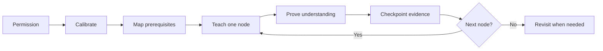

<h1 align="center">Adaptive Tutor</h1>

<p align="center">
  
</p>

<p align="center">
  <strong>Personal tutoring that adapts—without mistaking memory for mastery.</strong>
</p>

<p align="center">Portable Agent Skills for Claude Code and Codex.</p>

<p align="center">
  <a href="#quick-install">Install</a> ·
  <a href="#start-learning">Start learning</a> ·
  <a href="#the-learning-loop">Learning loop</a> ·
  <a href="#privacy-by-default">Privacy</a>
</p>

Adaptive Tutor combines an evidence-driven teaching workflow with a small,
shared local learner model. It calibrates first, teaches one meaningful concept
at a time, asks for proof, and saves only durable progress at semantic
checkpoints.

For background, watch the [referenced video](https://www.youtube.com/watch?v=kzcI5F4tGiU&t=797s).

---

## Quick install

Install both skills for every detected agent:

```bash
npx skills add nhanvu0901/adaptive-tutor -g --all
```

See what the package contains before installing:

```bash
npx skills add nhanvu0901/adaptive-tutor --list
```

For local development, list the skills in a checkout:

```bash
npx skills add . --list
```

The `skills` CLI installs skill files into agent-specific locations. Do not copy
the learner store into Claude or Codex directories yourself.

## Start learning

After installation, ask naturally:

```text
Use the adaptive-tutor skill to teach me the foundations of SQL joins.
```

Or invoke the skill explicitly:

```text
$adaptive-tutor Teach me the foundations of SQL joins.
```

The tutor asks before actively reading global context, uses that context only for
learning personalization, and falls back to onboarding when access is denied or
unavailable.

## The learning loop



The map changes with the learner. A missed prerequisite reopens the relevant
node; a correct multiple-choice answer alone never proves explanation,
application, or transfer mastery.

## What is included

| Skill | Purpose |
| --- | --- |
| `adaptive-tutor` | Permission-aware tutoring, calibration, knowledge maps, one-node teaching, evidence, and checkpointed memory. |
| `learn-verify` | Verifies uncertain, current, niche, contested, or material claims before they are taught as fact. |

## Privacy by default

Before it opens any global Claude/Codex context or memory, Adaptive Tutor asks
for explicit permission. `allow_once` is session-only;
`allow_and_remember` stores only the permission choice; and `deny` starts or
continues with onboarding plus shared learner state.

Context and self-report are hypotheses, not proof of mastery. Only
learning-relevant signals may be retained; unrelated or sensitive information is
discarded.

## Memory that stays small

Learner state lives locally at `~/.adaptive-tutor/` and is shared by Claude Code
and Codex on the same machine:

```text
~/.adaptive-tutor/
├── LEARNER.yaml               # compact profile and consent decisions
├── mastery/<domain>.yaml      # relevant domain only
└── sessions/<date>-<topic>.md # cold lesson archive
```

The tutor holds day-to-day evidence in the active lesson. At a semantic
checkpoint—such as completing a concept, correcting a misconception, or ending a
lesson—it writes a bounded delta and applies it deterministically:

```bash
python <skill-dir>/scripts/merge_delta.py --delta <checkpoint-delta.json>
```

The gate accepts only evidence-backed, useful changes. It does not rewrite
persistent memory after every prompt.

## Claude Code and Codex

Both agents use the same learner state and teaching rules. When a host exposes a
native choice picker, the skill prefers it for permission prompts and calibration
questions; otherwise it uses numbered plain-text choices. Higher mastery still
requires open explanation, application, or transfer work.

## What V1 does not do

V1 is deliberately terminal-native. It does not include a web dashboard, cloud
database, background daemon, vector database, cross-machine sync, full spaced
repetition scheduler, or automatic edits to your global agent files.

## Development

Run these commands from the repository root:

```bash
python -m unittest discover -s tests -v
python -m compileall skills tests
python skills/adaptive-tutor/scripts/merge_delta.py --help
npx skills add . --list
```

The packaging suite verifies that the installed skill is self-contained and that
the checkpoint CLI works from an arbitrary directory.

## License

See [LICENSE](LICENSE) and [THIRD_PARTY_NOTICES.md](THIRD_PARTY_NOTICES.md).
